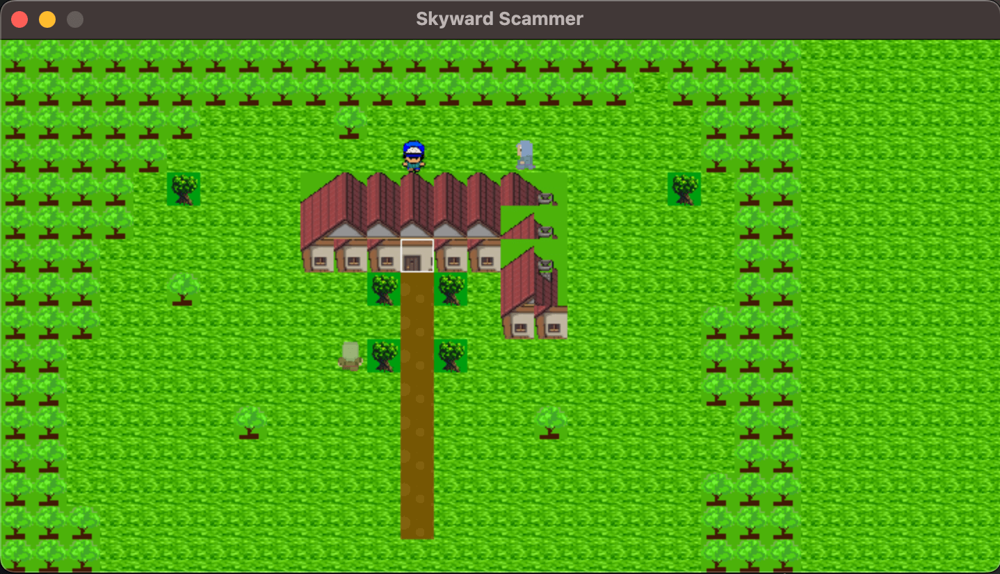

# Skyward Scammer

Skyward Scammer is a unique top-down RPG game where the protagonist, leveraging wit and charm, scams a dealer and embarks on an adventurous journey soaring above the world with balloons.

This project was a result of a lot of awesome online learning resources, especially `@javidx9` on Youtube. I hope its fun for you to play with :)



## Build

Skyward Scammer is built using C++ with SDL2 libraries. Follow the instructions below to compile and run the game:

### Requirements

- C++ compiler with C++17 support
- Homebrew, if you are on Mac

### Building on macOS or Linux:

Use the provided install.sh script. It will install the necessary libraries and build the project.

```
chmod +x install.sh
./install.sh
```

### Building on Windows:

I haven't written any installation script for Windows yet. You would need to install sdl2, sdl2_image, sdl2_ttf and sdl2_mixer, and you might have to make adjustments to cmake script too.

## Running

After successfully building the project, you can run the game with the following command:

```
cd build
./RPG
```

## Contact

For questions or issues, please open an issue on the GitHub repository.
